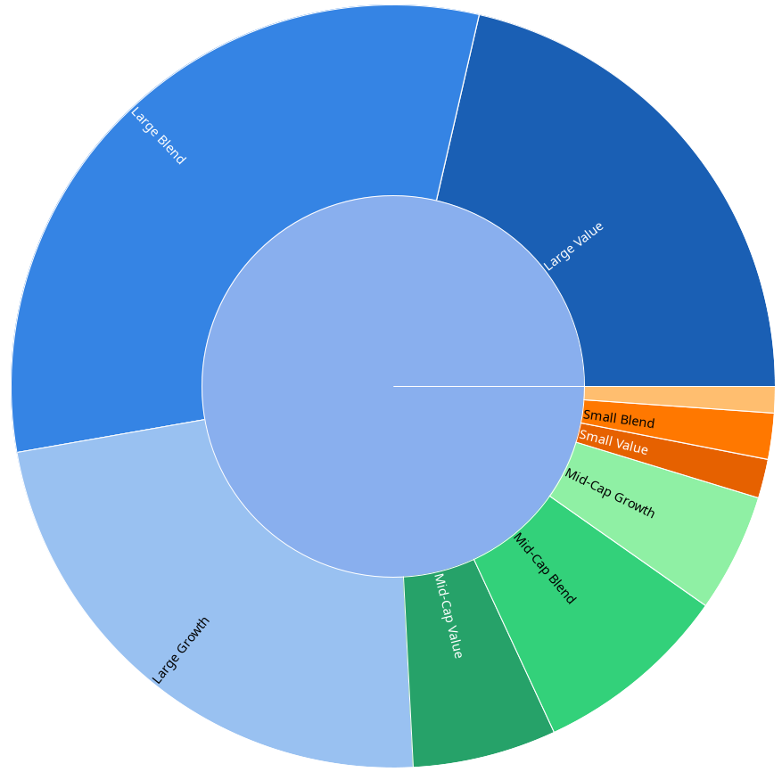
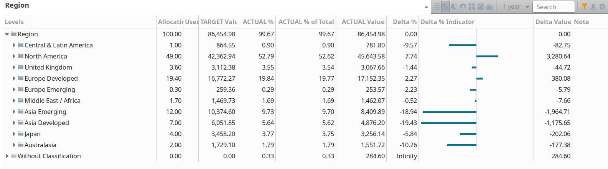
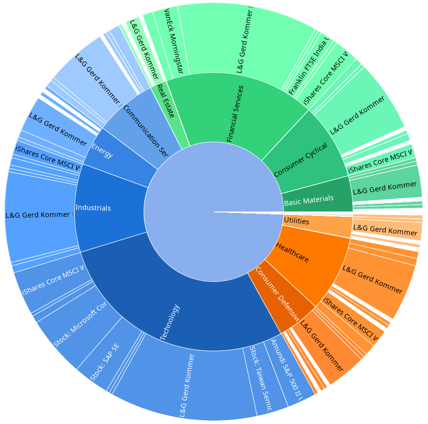
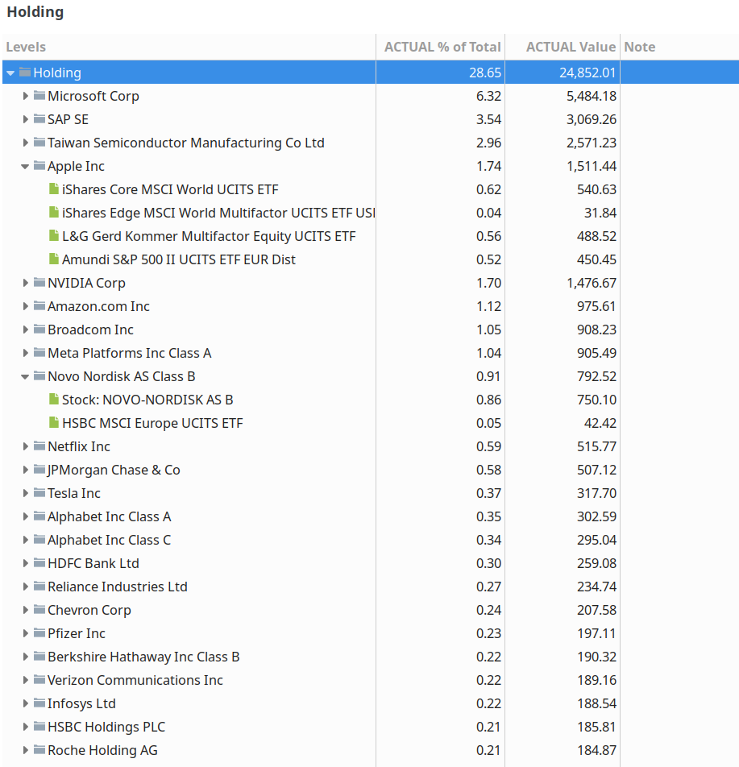

# pp-portfolio-classifier

THIS IS A TEMPORARY BRANCH TO DEVELOP A NEW VERSION USING A DIFFERENT API

_____________________________
GOALS:
- Use a better documented API (which is hopefully also more future-proof)
- Base the retrieval on ISIN not on MS secid
- Simplyfy the data retrieval and get rid of options and variants (like -xr, secid retrieval, PortfolioSAL-specific handling, ...)
- Extend the number of top holdings which can be retrieved (currently 10, in future: 0, 25, 50, 100, all)
- New API will probably also bring additional countries to the list
- Consider addition details on regions or maybe classification as emerging markets and developed markets
- Check, if retrieval of data for stocks can also be integrated in new API retrieval (or if it shoud stay as it is)
- Check, if bond etfs and maybe also bonds can be classified appropriately 
- Add calculator for an estímate of the German "Vorabpauschale" (low priority, but before end of the year 2025)
______________________________

Python script that automatically classifies funds/ETFs (for stocks) managed in [Portfolio Performance](https://www.portfolio-performance.info/) files by the asset types, sectors, regions, and countries they are invested in. Furthermore it determines the Top 10 holdings of each fund. The classifier uses the information from Morningstar as a data source for classification. It first tries to retrieve the information of the security from ngstar snapshot API and, if not found (and when `-xr` is used in command line), it tries to use the x-ray service at lt.morningstar.com (without classification for countries or holdings).
Based on the script by fbuchinger and fizban99.

This version of the script contains a major modification and additional features. Instead of creating taxonomies anew, it updates existing ones (if they exist). This has the advantage that e.g. colours and balancing weights set by the user are maintained. If you want to preserve the earlier versions, please duplicate and rename them before running the script. If you want taxonomies to be created from scratch as in the original version, please delete or rename them before running the script. Note that the script keeps previously obtained classifications of a fund/ETF, if the instrument is inactive or if no information can be retrieved from ngstar for the corresponding taxonomy. Note also that holdings are kept as classifications in the taxonomy 'Holding' even if they are no longer associated with any security.

Furthermore, there are the following improvements/features: Script now retrieves data for all active funds/ETFs in the file (not just for those having transactions). Script avoids category entries with zero weight. Script tries to round total sum of a taxonomy to 100% (or less) when it slightly exceeds 100%. Script ignores negative weights and rounds individual weight of a category down to 100%, if it exceeds 100%. Script is more verbose and informs user more about its activities. Script dumps the retrieved data into pp_data_fetched.csv (which is overwritten in each run).

Further addition: Script now supports a mechanism to retrieve classification for funds/ETFs from an alternative ISIN. It is used when ngStar data for the native ISIN does not contain classification for a taxonomy. User needs to add #PPC:[ISIN2=*XY0011223344*] with the desired ISIN value to note field of the security in PP (besides other content). (This does not work for individual stocks.)

Latest addition (Oct 2024): Script now also tries to retrieve classifications for stocks when `-stocks` is added to command line.
 
## Warnings & Known Issues
- Experimental software - use with caution! 
- Check the [Portfolio Performance Forum thread](https://forum.portfolio-performance.info/t/automatic-import-of-classifications/14672)
- New version of the script might use different colours than the original version when it needs to assign them. (Exiting colour assignments are anyway kept when a taxonomy is updated).
- This version updates the name of the geographic region "Europe Emerging". So if you run the script on an xml from a previous version, this category will be recreated from scratch and colours, balancing weights, etc. will not be maintained. (If you want to keep them, rename it manually from "Europe Emerging / Russia" to "Europe Emerging" before you run the script).
- ~~If you have issues with fetching data, try deleting the files cache.sqlite and isin2secid.json. Sometimes this helps :-).~~ (Use of cache disabled on Feb 6th 2025).

## Installation
requires Python 3, git and Portfolio Performance.
Steps:
1. `git clone` this repository
2. in the install directory run `pip3 install -r requirements.txt`
3. test the script by running either `python portfolio-classifier.py test/multifaktortest.xml` or `python portfolio-classifier.py test/multifaktortest.xml -stocks`. (The latter also updates the stocks included in the the xml file). Then open the resulting file `pp_classified.xml` in Portfolio Performance.

## How it works:

**Important: Never try this script on your original Portfolio Performance files -> risk of data loss. Always make a copy first that is safe to play around with or create a dummy portfolio like in test folder.**

1. In Portfolio Performance, save a copy of your portfolio file as unencrypted xml. The script won't work with any other format.
2. The secid is the value of the attribute is the code at the end of the Morningstar url of the security (the id of length 10 after the  "?id=", something like 0P00012345). The script will try to get it from the Morningstar website, but the script might have to be configured with the domain of your country, since not all securities area available in all countries. The domain is only important for the translation from isin to secid. Once the secid is obtained, the Morningstar APIs are country-independent. The script caches the mapping between the isin and the secid plus the security id type and the domain of the security into a file called isin2secid.json in order to reduce the number of requests.
3. Run the script `python portfolio-classifier.py <input_file> [<output_file>] [-d domain] [-stocks] [-xr]` If output file is not specified, a file called pp_classified.xml will be created. If domain is not specified, 'de' will be used for morningstar.de. This is only used to retrieve the corresponding internal Morningstar id (secid) for each isin.
4. open pp_classified.xml (or the given output_file name) in Portfolio Performance and check out the modified or added taxonomies and classifications.

## Gallery

### Autoclassified stock-style

### Autoclassified Regions

### Autoclassified Sectors

### List of stocks and holdings from Top 10 of each fund

