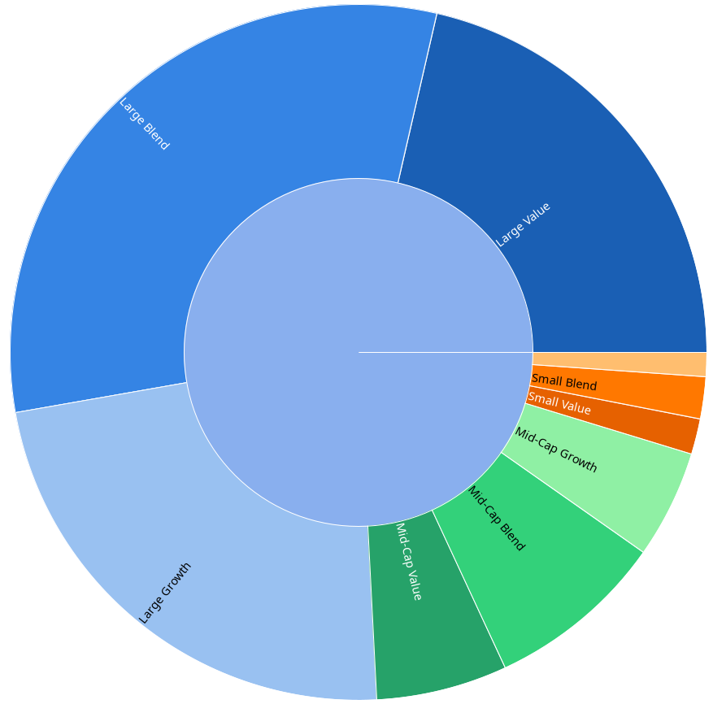
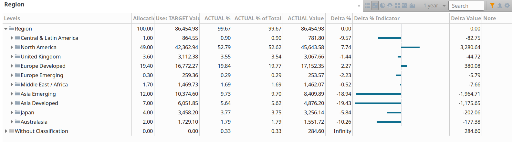
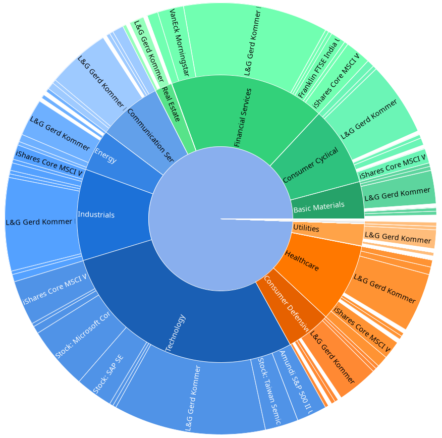
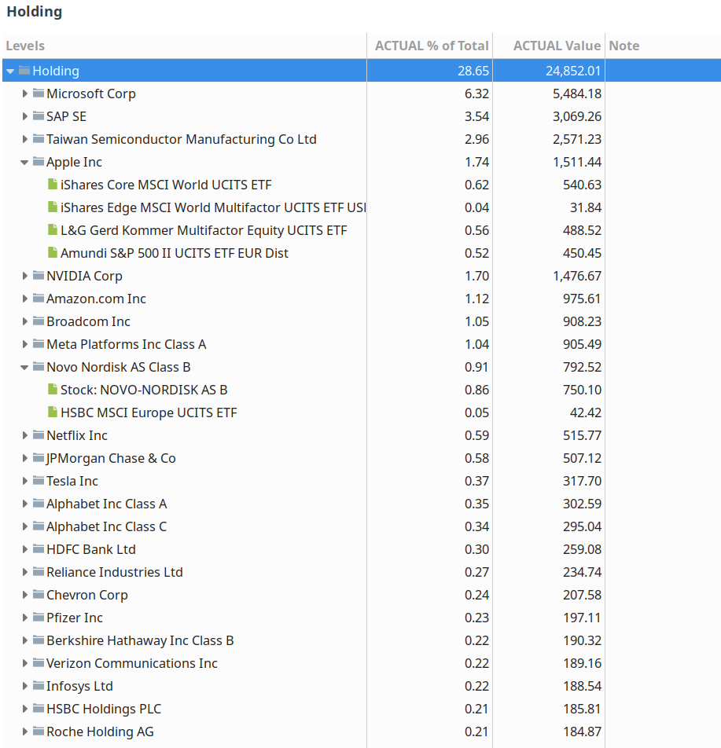

# pp-portfolio-classifier

**UPDATE (June 2026)**:

- Morningstar has recently made various changes which affected the script.
- Current situation is that "new-api-branch" does not work anymore.
- However, "main" branch (this branch) has been modified and now functions again.
- Note that "main" branch has less features than "new-api-branch".
- Current solution is less user-friendly:
  - User needs to manually copy an authentication token from a Morningstar Website into the `AUTH_TOKEN` variable at the top of `portfolio-classifier.py` (around line 19). The token is passed as `access_token` to Morningstar `api-global.morningstar.com/sal-service` endpoints.
  - Script relies on manually maintained mapping between ISIN and SecId of Morningstar. When mapping is unknown, user is prompted for input and input is stored in isin2secid.json (which user might need to edit to modify existing entries).

## Overview

Python script that automatically classifies funds/ETFs (for stocks) managed in [Portfolio Performance](https://www.portfolio-performance.info/) files by the asset types, stock styles, stock sectors, regions, and countries they are invested in. Furthermore, it determines the top holdings of each fund (number of holdings depends on what Morningstar provides, typically 10). The classifier uses the information from Morningstar as a data source for classification.

Based on the script by fbuchinger and fizban99.

This version of the script contains a major modification and additional features. Instead of creating taxonomies anew, it updates existing ones (if they exist). This has the advantage that e.g. colours and balancing weights set by the user are maintained. Note that the script keeps previously obtained classifications of a fund/ETF, if the instrument is inactive or if no information can be retrieved from Morningstar for the corresponding taxonomy. Note also that holdings are kept as classifications in the taxonomy 'Holding' even if they are no longer associated with any security.

Furthermore, there are the following improvements/features: Script now retrieves data for all active funds/ETFs in the file (not just for those having transactions), except if #PPC:SKIP is added to note field of the security in PP (besides other content). Script avoids category entries with zero weight. Script tries to round total sum of a taxonomy to 100% (or less) when it slightly exceeds 100%. Script ignores negative weights and rounds individual weight of a category down to 100%, if it exceeds 100%. Script is more verbose and informs user more about its activities. Script dumps the retrieved data into pp_data_fetched.csv (which is overwritten in each run).

Further addition: Script now supports a mechanism to retrieve classification for funds/ETFs from an alternative ISIN. It is used when Morningstar data for the native ISIN does not contain some classification data for a taxonomy. User needs to add #PPC:[ISIN2=*XY0011223344*] with the desired ISIN value to note field of the security in PP (besides other content). Script will then try to retrieve missing information from this alternative ISIN. (This does not work for individual stocks, but only for funds/ETFs).

Addition in Oct 2024: Script now also tries to retrieve classifications for stocks when `-stocks` is added to command line.

June 2026: Note that there is now a folder "taxonomy-json-templates" which contains files which can be used to define the colours of classifications. If used to create the taxonomies before the script is run, they can also be used to pre-determine the sequence of taxonomies and classifications in the PP xml file.

More in June 2026: Script now has command line option `-top_holdings TOP_HOLDINGS` (short form: `-top`) which defines how many top holdings are retrieved for etfs/funds; integer value: range 0 to 3200; special values: '1' = default output from Morningstar; '0' = keeps existing holding data. (Values above 100 are not recommended in combination with use in PP as they might overload the GUI). Example: `-top 10`.

## Warnings & Known Issues

- Experimental software - use with caution! 
- Check the [Portfolio Performance Forum thread](https://forum.portfolio-performance.info/t/automatic-import-of-classifications/14672)
- If you have issues with fetching data, try deleting the file cache.sqlite. Sometimes this helps :-).
- Management of isin2secid.json is not perfect and in seldom cases, the script might corrupt the isin2secid.json file. Please make backup copies of isin2secid.json for that case.

## Installation

requires Python 3, git and Portfolio Performance.
Steps:

1. `git clone` this repository
2. in the install directory run `pip3 install -r requirements.txt`
3. before every run, set a valid authentication token in the `AUTH_TOKEN` variable near the top of `portfolio-classifier.py` (around line 19). The script exits immediately if `AUTH_TOKEN` is left empty.
4. test the script by running either `python portfolio-classifier.py test/multifaktortest.xml` or `python portfolio-classifier.py test/multifaktortest.xml -stocks`. (The latter also updates the stocks included in the xml file). Then open the resulting file `pp_classified.xml` in Portfolio Performance.

## How it works:

**Important: Be aware that the script will overwrite some of your data in the Portfolio Performance file -> risk of data loss. Always make sure that you still have a copy you can fall back to.**

1. In Portfolio Performance, save a copy of your portfolio file as unencrypted XML. The script won't work with any other format (i.e. it also doesn't work with the more recent 'XML with "id" attributes' format of Portfolio Performance).
2. Run the script `python portfolio-classifier.py <input_file> [<output_file>] [-stocks] [-top_holdings TOP_HOLDINGS]`. If output file is not specified, a file called pp_classified.xml will be created. The script also writes the retrieved classification data to pp_data_fetched.csv (overwritten on each run).
3. open pp_classified.xml (or the given output_file name) in Portfolio Performance and check out the modified or added taxonomies and classifications.
4. isin2secid.json contains the mapping of ISINs to Morningstar SecIds (which needs to be provided by the user). Edit (or delete) that file, if the mapping does not match.

## Gallery

### Autoclassified Stock Style

### Autoclassified Regions

### Autoclassified Sectors

### List of stocks and holdings from Top 10 of each fund

